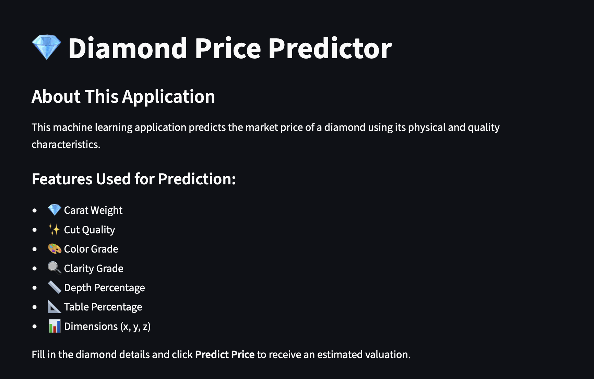
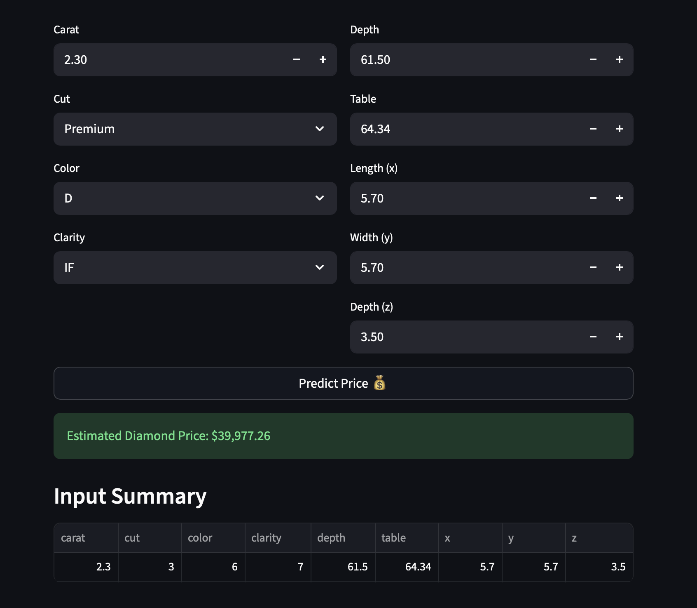

# 💎 Diamond Price Prediction

A Machine Learning web application that predicts the market price of a diamond based on its physical and quality characteristics. This project covers the complete machine learning workflow, including data preprocessing, feature engineering, model training, evaluation, and deployment using Streamlit.

## 🚀 Live Demo

https://your-app-name.streamlit.app

---

## 📌 Project Overview

The objective of this project is to predict the price of a diamond using its physical and quality characteristics.

### Project Workflow

- Data Cleaning
- Exploratory Data Analysis (EDA)
- Feature Engineering
- Feature Encoding
- Feature Scaling
- Model Training
- Model Evaluation
- Streamlit Deployment

---

## 📊 Dataset

Dataset Source: Kaggle Diamonds Dataset

### Features Used

| Feature | Description |
|----------|-------------|
| carat | Weight of the diamond |
| cut | Quality of the cut |
| color | Diamond color grade |
| clarity | Measure of diamond clarity |
| depth | Total depth percentage |
| table | Width of the diamond's table |
| x | Length (mm) |
| y | Width (mm) |
| z | Depth (mm) |

### Target Variable

| Variable | Description |
|-----------|-------------|
| price | Diamond Price |

---

## 🛠️ Tech Stack

- Python
- Pandas
- NumPy
- Scikit-Learn
- Streamlit
- Pickle

---

## 📂 Project Structure

```bash
Diamond Price Prediction/
│
├── images/
│   ├── homepage.png
│   └── prediction_result.png
│
├── Models/
│   ├── model.pkl
│   └── scaler.pkl
│
├── Notebooks/
│   ├── Data_Cleaning.ipynb
│   ├── EDA_FE.ipynb
│   ├── Model_training.ipynb
│   ├── diamonds.csv
│   ├── diamonds_cleaned.csv
│   └── diamond_encoded.csv
│
├── app.py
├── requirements.txt
└── README.md
```


---

## ⚙️ Data Preprocessing

### Categorical Encoding

#### Cut

```python
{
    'Fair': 0,
    'Good': 1,
    'Very Good': 2,
    'Premium': 3,
    'Ideal': 4
}
```

#### Color

```python
{
    'J': 0,
    'I': 1,
    'H': 2,
    'G': 3,
    'F': 4,
    'E': 5,
    'D': 6
}
```

#### Clarity

```python
{
    'I1': 0,
    'SI2': 1,
    'SI1': 2,
    'VS2': 3,
    'VS1': 4,
    'VVS2': 5,
    'VVS1': 6,
    'IF': 7
}
```

### Feature Scaling

StandardScaler was used to normalize the input features before model training and prediction.

---

## 🤖 Model Training

The dataset was split into training and testing sets.

The model was trained using Scikit-Learn and evaluated using:

- R² Score
- Mean Absolute Error (MAE)
- Root Mean Squared Error (RMSE)

---

## 📈 Model Performance

| Metric | Score |
|----------|----------|
| R² Score | Add Your Score |
| MAE | Add Your Score |
| RMSE | Add Your Score |

---

## 💻 Installation & Setup

### Clone Repository

```bash
git clone https://github.com/yourusername/Diamond-Price-Prediction.git
```

### Navigate to Project Directory

```bash
cd Diamond-Price-Prediction
```

### Install Dependencies

```bash
pip install -r requirements.txt
```

### Run Streamlit Application

```bash
streamlit run app.py
```

---

## 💎 Application Features

- Predict Diamond Prices Instantly
- Interactive Streamlit Interface
- Real-Time Predictions
- Input Summary Display
- Scaled and Preprocessed Inputs
- Responsive Design

---

## 📸 Screenshots

### Home Page



### Prediction Result



---

## 🎯 Future Enhancements

- Feature Importance Visualization
- Interactive EDA Dashboard
- Model Comparison
- Prediction History Tracking
- Download Prediction Reports

---

## 👨‍💻 Author

### Dhruvit Jalodhara

AI Engineering Student | Machine Learning Enthusiast

GitHub: https://github.com/your-github-username

LinkedIn: https://www.linkedin.com/in/dhruvit-jalodhara

---

## ⭐ Support

If you found this project useful, please consider giving it a ⭐ on GitHub.

Feedback and suggestions are always welcome!